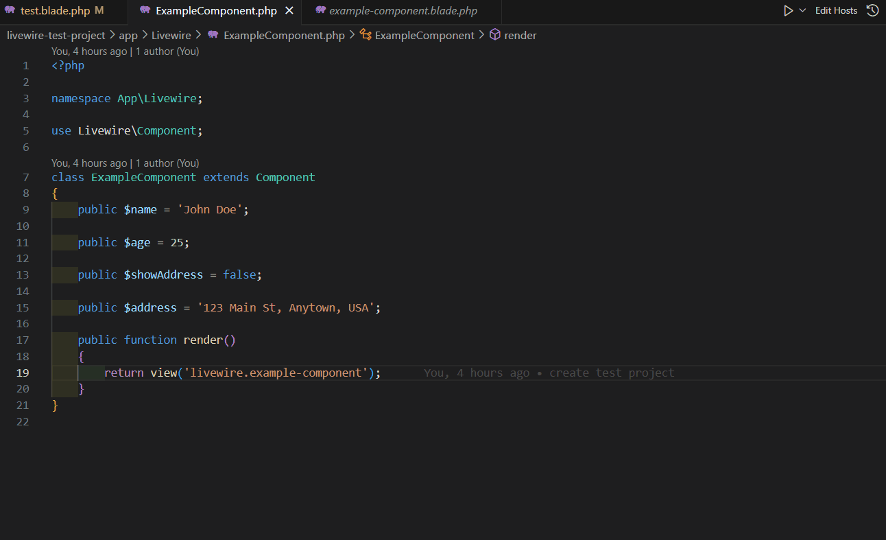

# VSCode Livewire Support

A Visual Studio Code extension to supercharge your Laravel Livewire development experience.

[](https://buymeacoffee.com/doonfrs)

## 📸 Screenshots



## Features

- **Go to Definition**
  - Ctrl+Click or F12 on `<livewire:component-name>` in Blade files to jump to the corresponding PHP component class.
  - Ctrl+Click or F12 on `@livewire('component-name', [...])` to jump to the PHP class.
  - Ctrl+Click or F12 on `view('livewire.example-component')` in PHP to jump to the Blade view file.
- **Intelligent Auto-Completion**
  - Get attribute suggestions for Livewire components in Blade files:
    - Inside `<livewire:component-name ...>` tags, auto-complete all public properties of the component (in kebab-case and with `:` prefix for binding).
    - Inside the array of `@livewire('component-name', [ ... ])`, auto-complete all public properties as array keys (in kebab-case, only in key position).
- **Supports Nested Projects**
  - Works even if your Laravel project is in a subfolder of your workspace.
- **Zero Configuration**
  - Just install and start coding!

## Installation

### Using VS Code CLI

```bash
code --install-extension doonfrs.livewire-support
```

### From VS Code Marketplace UI

1. Launch VS Code
2. Go to Extensions (Ctrl+Shift+X)
3. Search for "doonfrs.livewire-support"
4. Click Install

### From URL

- Open [https://marketplace.visualstudio.com/items?itemName=doonfrs.livewire-support](https://marketplace.visualstudio.com/items?itemName=doonfrs.livewire-support)
- Click Install

## Usage Examples

### Example Livewire Component

```php
// app/Livewire/ExampleComponent.php
namespace App\Livewire;
use Livewire\Component;
class ExampleComponent extends Component
{
    public $name = 'John Doe';
    public $age = 25;
    public $showAddress = false;
    public $address = '123 Main St, Anytown, USA';
    public function render() {
        return view('livewire.example-component');
    }
}
```

### Example Blade Usage

```blade
<livewire:example-component name="John Doe" age="25" show-address="true" address="123 Main St, Anytown, USA" />

{{-- Or using the directive --}}
@livewire('example-component', [
    'name' => 'Jane Smith',
    'age' => 30,
    'show-address' => true,
    'address' => '456 Elm St, Othertown, USA'
])
```

- **Ctrl+Click** or **F12** on the component name to jump to the PHP class.
- **Auto-complete** for attributes and array keys is available in both syntaxes.

### Example Blade View

```blade
<!-- resources/views/livewire/example-component.blade.php -->
<div>
    <h1>Hello World</h1>
    <h2>Name: {{ $name }}</h2>
    <h2>Age: {{ $age }}</h2>
    <h2>Show Address: {{ $showAddress ? 'Yes' : 'No' }}</h2>
    @if ($showAddress)
        <h2>Address: {{ $address }}</h2>
    @endif
</div>
```

## Contributing

- **Star the Repository**: Show your support and help others discover the extension
- **Report Issues**: Found a bug? Let us know on the GitHub issues page
- **Suggest Features**: Have ideas for improvements? We'd love to hear them
- **Submit Pull Requests**: Code contributions are always welcome
- **Share with Friends**: Help spread the word about Project Finder

## Github project

[https://github.com/doonfrs/vscode-livewire-support](https://github.com/doonfrs/vscode-livewire-support)

### Code Structure

- Main extension logic: `src/extension.ts`
- Helper utilities: `src/LivewireHelper.ts`

## License

MIT
